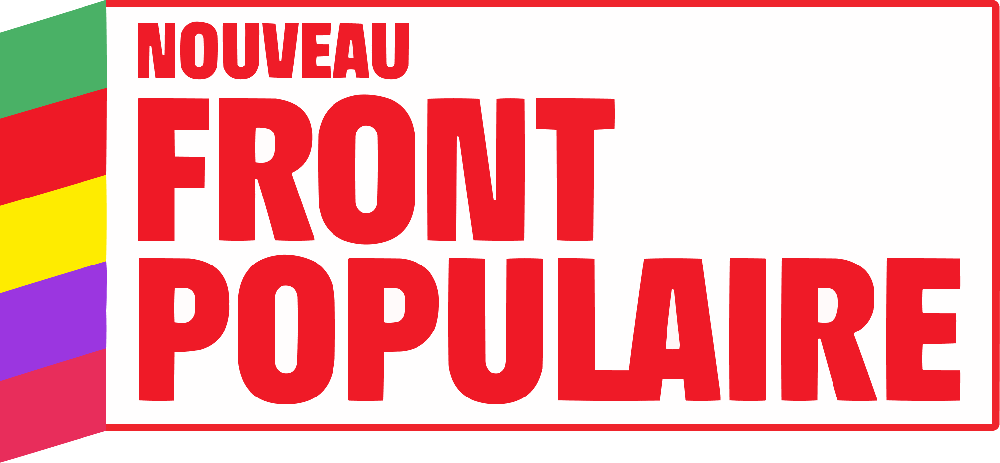
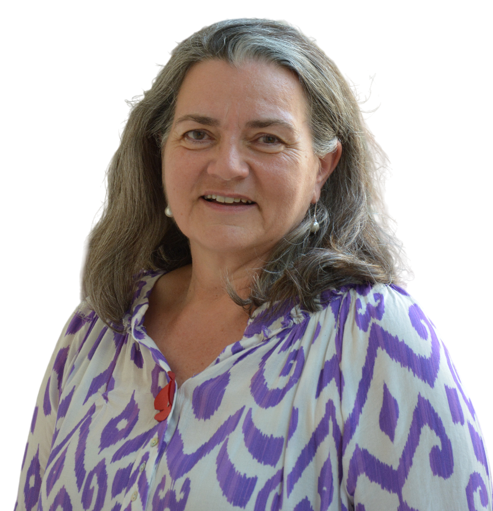
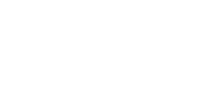
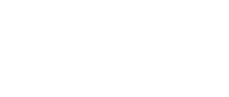
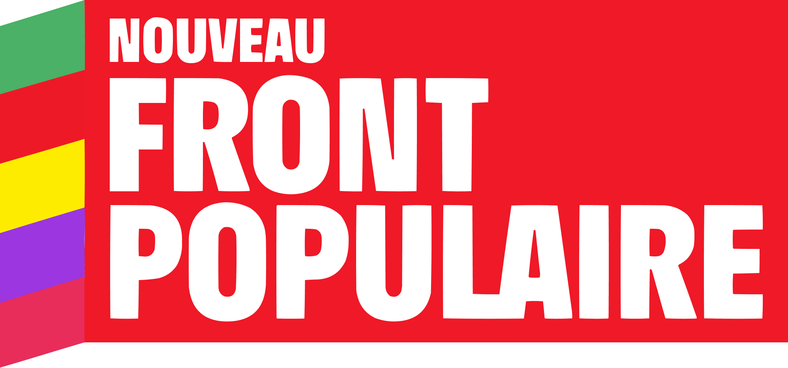

<header>
  

    
  

  

    <h1>Le 30 juin et le 7 juillet,  votez Cécilia Gondard !</h1>
  

</header>

<section class="entete">
  

    
  

    

      

        <a href="#programme" class="btn">Le programme</a>
      

      

        <a href="#contact" class="btn">Les événements</a>
      

      

        <a href="#voter" class="btn">Comment voter</a>
      

      

        <a href="#procuration" class="btn">Faire une procuration</a>
      

  

</section>

<section id="programme">
  

    <h2>Notre programme</h2>

    <h3>Changer le quotidien des Français du Benelux avec le Nouveau Front Populaire</h3>

    <ul>
      <li>
        Rétablir des services publics de proximité : tournées consulaires, bureaux de vote
      </li>
      <li>
        Dire NON au tout numérique : réintégrer l'accueil téléphonique et réduire les délais de prise de prise de rendez-vous
      </li>
      <li>
        Reconnaître tous les diplômes Benelux-France
      </li>
      <li>
        Instaurer une carte européenne de handicap avec la France et les pays du Benelux, suspendre le moratoire sur l'accueil des adultes handicapés français en Belgique, et créer suffisamment de places d'accueil en France
      </li>
      <li>
        Respecter et revoir le calcul des droits à la retraite, supprimer les certificats de vie et fiscaliser les retraites françaises en France
      </li>
      <li>
        Défendre le réseau AEFE dans sa mission de service public
      </li>
      <li>
        Sauver les Alliances françaises et tous les acteurs associatifs œuvrant pour la culture française et la francophonie
      </li>
    </ul>

    

      

        <a href="https://www.nouveaufrontpopulaire.fr/" class="btn">Le programme du Nouveau Front Populaire</a>
      

      

        <a href="#candidature" class="btn">Nos candidates</a>
      

    

  

</section>

<section id="candidature">
  

    <article>
      

        <!-- Ci-dessous la photo de votre candidat·e -->
        
      

      

        <h2>Cécilia Gondard - candidate</h2>
      
        <!-- Ci-dessous un petit texte reprenant 2 ou 3 mesures nationales en les déclinant sur les impacts locaux. -->
        
Candidate pour le Nouveau Front Populaire, je suis aussi élue Conseillère des Français de l'étranger et Membre de l'Assemblée des Français de l'étranger.

        
Secrétaire internationale adjointe du Parti Socialiste français, je soutiens également le parti socialiste belge, mon deuxième parti. Engagée pour la défense d'une Europe solidaire au service des citoyens de puis de nombreuses années, j'ai également été en charge de l'égalité femmes-hommes au parti socialiste pendant plusieurs années, créant le réseau féministe, et le triple dispositif de lutte contre les violences faites aux femmes.

        
Mère de deux enfants, je suis en Belgique depuis 17 ans et j'ai vécu auparavant en France, aux Pays-Bas, en Allemagne et au Royaume-Uni. J'aime voyage, jouer de la musique et défendre les combats qui me tiennent à cœur : la lutte pour l'environnement et contre le changement climatique, la défense des services publics et pour une société solidaire et tolérante, la lutte contre les inégalités mondiales, en particulier entre les femmes et les hommes.

      

    </article>
  
    <article>
      

        <!-- Si besoin car non présent·e sur la 1e photo, ci-dessous la photo de votre suppléant·e -->
        
      

      

        <h2>Catherine Libeaut - suppléante</h2>

        <!-- Ci-dessous un petit texte reprenant 2 ou 3 mesures nationales en les déclinant sur les impacts locaux. -->
        
Conseillère des Français.es de l’étranger depuis 2014, élue à l’Assemblée des Français.es de l’Étranger pour le Benelux en 2021 au sein du groupe d'Union de la gauche, je vis aux Pays-Bas depuis 24 ans. Riche de mon expérience d'élue locale et de mon engagement associatif et politique, je suis ravie d’être la suppléante de Cécilia à ces élections législatives anticipées pour le Benelux au nom du Nouveau Front Populaire qui a pour objectif de répondre aux urgences sociales, écologiques, démocratiques et pour la paix.

        
Adhérente depuis 2005 de Français du monde-ADFE, association reconnue d’utilité publique pour représenter les Français.e.s de l’étranger, je suis membre du Conseil d’administration et du Bureau National et j’en suis la Secrétaire générale depuis fin 2022. En charge du groupe Biodiversité, j’anime des actions de nettoyage et de lutte contre le plastique dans le cadre #Avrilpourlaplanète.

        
Membre d'EELV/Les écologistes Hors de France depuis 2010, j’en ai été la co-secrétaire durant deux ans. Militante associative et politique, je suis sensible à la vie de notre cité et à notre environnent. J’ai eu l’opportunité d’organiser des projections de films suivis de débats avec Marie-Monique Robin sur la transition écologique, sur la lutte contre les pesticides à travers le mouvement "Nous vous voulons des coquelicots" et de mobiliser pour les marches pour le climat aux Pays-Bas.

      

    </article>
  

</section>

<section class="contact">
  

    <h2>Nos événements</h2>

    <ul>
      <li>
        Lundi 24 juin à 18h30 à Bruxelles : grand meeting à la Maison du Peuple
      </li>
      <li>
        Mardi 25 juin à 18h00 à Luxembourg : réunion publique au Café Français
      </li>
      <li>
        Mercredi 26 juin à 20h00 à La Haye : réunion publique au Studio Loos
      </li>
    </ul>

    

      

        <a href="https://forms.gle/3dv7BHD7EibFi5f87/" class="btn">Infos et inscriptions</a>
      

      

    
Écrivez-nous à <a href="mailto:contact@ceciliagondard2024.fr">contact@ceciliagondard2024.fr</a>

      

  

</section>

<section class="logos_partis">
  

    <h2>L'union de la gauche, c'est le Nouveau Front Populaire !</h2>

    <ul>
      <li>
          
      </li>
      <li>
        
      </li>
      <li>
        
      </li>
      <li>
        
      </li>
    </ul>

    
avec le soutien de Place publique, Génération.s, GES, GRS, MRC, LRDG, L'engagement, GDS, Ensemble !, Parti de gauche, Picardie Debout, PEP, Révolution Écologique pour le Vivant (REV), Allons enfants, ADS, Nouvelle Donne, La Jeune Garde, Union démocratique bretonne (UDB), ESNT 

  

</section>

<section id="procuration">
  

    
Vous ne pouvez pas vous déplacer le 30&nbsp;juin ou le 7&nbsp;juillet prochain ?

  
    <h2>Votez par procuration</h2>
  
    
Il vous suffit de remplir le formulaire ci-dessous.

    

      

         <a href="https://t.co/zh0UthlhMj" class="btn">Faire une procuration</a>
      

      

        <a href="#voter" class="btn">Retrouvez toutes les informations pour voter sur la 4e circonscription des Français de l'étranger (Belgique, Pays-Bas et Luxembourg)</a>
      

    

  

</section>

<section id="voter">
  

    <h2>Voter en Belgique, aux Pays-Bas ou au Luxembourg</h2>

    <ul>
      <li>Vous voulez voter en ligne ?</li>
      <li>Vous voulez connaître votre bureau de vote ?</li>
      <li>Vous n'êtes pas sûr·es d'être inscrit·e ?</li>
    </ul>

    
Retrouvez les informations pour <strong>voter en ligne</strong> (au premier tour, du 25 juin à midi au jeudi 27 juin 2024 à midi, heure de Paris) sur <a href="https://www.diplomatie.gouv.fr/fr/services-aux-francais/voter-a-l-etranger/elections-legislatives-2024/presentation-du-vote-par-internet/">diplomatie.gouv.fr</a>

    
Trouvez où <strong>voter les 30 juin et 7 juillet</strong> en <a href="https://bruxelles.consulfrance.org/Ou-voter-3097">Belgique</a>, aux <a href="https://amsterdam.consulfrance.org/Bureau-de-vote-Amsterdam-ou-La-Haye-1263">Pays-Bas</a> ou au <a href="https://lu.ambafrance.org/Elections-legislatives-anticipees-de-2024-rendez-vous-a-Lux-Expo">Luxembourg</a>

Retrouvez vos informations pour <strong>voter les 30 juin et 7 juillet</strong> sur <a href="https://www.service-public.fr/particuliers/vosdroits/R51788">Service-Public.fr</a>

  

</section>

<section class="villes">
  

    
    
    <h2>Le 30&nbsp;juin et le 7&nbsp;juillet, votez et faites voter autour de vous !</h2>
    
    <!-- Ci-dessous listez les villes de votre circonscription pour aider les moteurs de recherche à trouver votre site -->
    
Que vous soyez électeur ou électrice à Luxembourg, Liège ou Leyde, chaque vote compte pour faire gagner le Nouveau Front Populaire et battre l'extrême-droite !

  

</section>

<section class="footer">
    Candidature de Cécilia Gondard et Catherine Libeaut sur la 4e circonscription des Français de l'étranger.
</section> 